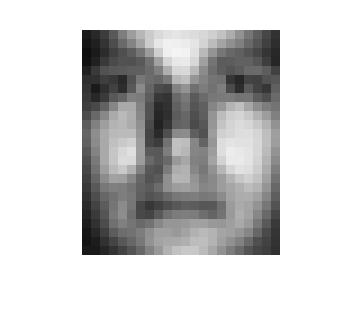
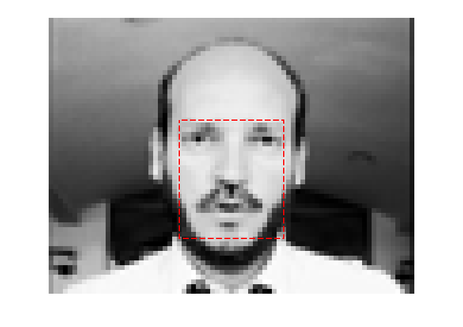

<html><head></head>

<body>
<h1>Detecci&oacute;n de caras por medio del An&aacute;lisis por Componentes Principales (PCA)</h1>

 <h2>Contenido</h2>
  

    <ul>
      <li><a href="#2">Imagenes de entrenamiento</a></li>
      <li><a href="#5">Imagenes de prueba</a></li>
      <li><a href="#8">Imagenes Escaladas</a></li>
      <li><a href="#13">An&aacute;lisis por Componentes Principales</a></li>
      <li><a href="#18">Cara Promedio</a></li>
      <li><a href="#19">Imagen de prueba</a></li>
      <li><a href="#23">Error m&iacute;nimo</a></li>
      <li><a href="#31">Recuadro</a></li>
    </ul>
  

  <pre class="codeinput">
  clc
  clear all;
</pre><h2>Imagenes de entrenamiento</h2><pre class="codeinput">Im=[];
for i=1:38
    str=strcat('../YaleCropped/yale_',int2str(i),'.pgm');
    eval('img=im2double(imread(str));');
    Im(:,:,i)=img;
end
</pre>
Se hace una ecualizaci&oacute;n del histograma a las im&aacute;genes de entrenamiento
<pre class="codeinput">for i=1:38
    Im(:,:,i) = histeq(Im(:,:,i),256);
end
</pre><h2>Imagenes de prueba</h2><pre class="codeinput">Im_p = [];
numIm = 80;
for i=1:1:numIm
    str = strcat('C:\Users\Jesus\Pictures\Images_DataBases\BioID\BioID_',sprintf('%.4d',i),'.pgm');
    eval('Im_p(:,:,i)=im2double(imread(str));')
end
</pre>
De igual forma las im&aacute;genes de prueba son ecualizadas
<pre class="codeinput">for i=1:numIm
    Im_p(:,:,i) = histeq(Im_p(:,:,i),256);
end
</pre><h2>Imagenes Escaladas</h2>
Se hace primero la reducci&oacute;n de las im&aacute;genes de prueba a un 20% de su tama&ntilde;o original, de 286x384 a 58x77
<pre class="codeinput">escala = 0.2;

Im_p_m = [];
for i=1:numIm
    Im_p_m(:,:,i) = imresize(Im_p(:,:,i),escala);
end

[I,J,L] = size(Im_p_m);
</pre>
Tres diferentes tama&ntilde;os de las im&aacute;genes de entrenamiento dependiendo de la escala de las im&aacute;genes de prueba. Se hicieron mediciones de tres im&aacute;genes diferentes y se encontr&oacute; un aproximado de la proporci&oacute;n de la cara con el resto de la imagen para escoger la escala.
<pre class="codeinput">Im_m = [];
[col, fil] = size(Im_p_m(:,:,1));

% % Imagen 37
% for i=1:38
%     Im_m(:,:,i) = imresize(Im(:,:,i),[fil/3.2, col/3.6]);
% end

% Imagen 16
for i=1:38
    Im_m(:,:,i) = imresize(Im(:,:,i),[fil/3.2, col/2.7]);
end

% % Imagen 70
% for i=1:38
%     Im_m(:,:,i) = imresize(Im(:,:,i),[fil/2.6, col/1.8]);
% end
</pre><h2>An&aacute;lisis por Componentes Principales</h2>
Para ahorrar espacio en el c&oacute;digo se hicieron dos funciones para el an&aacute;lisis por componentes principales, la primera tiene como prototipo:

<b><tt>[eigValues, eigVectors, avFace, eigFaces, media, weights] = PCA(Imagen,K)</tt></b>

donde:

<ul><li><b><tt>eigValues</tt></b>: Eigen Valores</li><li><b><tt>eigVectors</tt></b>: Eigen Vectores</li><li><b><tt>avFace</tt></b>: Cara Media</li><li><b><tt>eigFaces</tt></b>: Eigen Caras</li><li><b><tt>media</tt></b>: Media</li><li><b><tt>weights</tt></b>: Pesos</li><li><b><tt>Imagen</tt></b>: Imagenes de entrenamiento</li><li><b><tt>K</tt></b>: N&uacute;mero de Autovectores a usar</li></ul>

De pruebas anteriores se obtuvo que al usar 25 eigen vectores, se utiliza el 90% de la informaci&oacute;n necesaria para la reconstrucci&oacute;n de las im&aacute;genes.
<pre class="codeinput">K = 25;     % Numero de Eigenvectors
</pre><pre class="codeinput">[eigValues, eigVectors, avFace, eigFaces, media, weights] = PCA(Im_m,K);
</pre><pre class="codeinput">[J,I] = size(avFace);
tamano = (size(Im_p_m(:,:,1))-size(Im_m(:,:,1)));
N = tamano(1);
M = tamano(2);
</pre><h2>Cara Promedio</h2><pre class="codeinput">figure(1)
imshow(avFace,'InitialMagnification',900)
</pre> <h2>Imagen de prueba</h2>
Anteriormente se cargaron varias im&aacute;genes de prueba, para mostrar el funcionamiento de este programa se elige una imagen de prueba de la cual se obtuvo uno de los valores de escala, por ejemplo la imagen n&uacute;mero 16
<pre class="codeinput">imagen = 16;
</pre>
Se obtienen (N-J)*(M-I) segmentos de la imagen original de tama&ntilde;o J x I, donde: [N x M] es el tama&ntilde;o de la imagen de prueba  y [J x I] es el tama&ntilde;o de las imagenes de entrenamiento. Es decir, para esta escala en particular se obtuvieron 33*55 = 1815 im&aacute;genes cada una de tama&ntilde;o 25x22
<pre class="codeinput">Im_p_R = [];
tic;    % Inicia el reloj
i=1;
for m=1:M
    for n=1:N
       Im_p_R(:,:,i) = Im_p_m(n:J+n-1,m:I+m-1,imagen);
       i=i+1;
    end
end
</pre><h2>Error m&iacute;nimo</h2>
Una vez obtenidas todos los segmentos de la imagen de prueba, se pocede a hacer la reconstrucci&oacute;n de cada una para obtener el segmento con el error m&iacute;nimo el cual, idealmente, correspondr&aacute; a la cara detectada. Este proceso se realiza con la segunda funci&oacute;n hecha:

<b><tt>[error] = PCA_error(Segmentos, eigVectors, K, media, wights)</tt></b>

donde:

<ul><li><b><tt>error</tt></b>: Error m&iacute;nimo con respecto al conjunto de eigen caras</li><li><b><tt>Segmentos</tt></b>: Segmentos de la imagen de prueba</li><li><b><tt>K</tt></b>: N&uacute;mero de Autovectores a usar</li><li><b><tt>media</tt></b>: Media</li><li><b><tt>weights</tt></b>: Pesos</li></ul>
<pre class="codeinput">for i=1:M*N
    e(i) = PCA_error(Im_p_R(:,:,i),eigVectors, K, media, weights);
end
</pre>
El vector <b><tt>e</tt></b> contiene el error m&iacute;nimo de cada uno de los segmentos probados, es decir este vector es de tama&ntilde;no (N-J)*(M-I), para este ejemplo el vector de errores es de tama&ntilde;o 1815

Por &uacute;ltimo, se encuentra el valor m&iacute;nimo del vector de errores el cual ser&aacute; el correspondiente al segmento de la imagen original que contiene la cara. La funci&oacute;n <tt>[x,y]=min(e)</tt> devuelve el valor del error m&iacute;nimo (<b><tt>x</tt></b>) y la posic&oacute;n (<b><tt>y</tt></b>) de ese valor en el vector <tt>e</tt>, de esta forma es f&aacute;cil conocer el segmento de la imagen que nos intereza.
<pre class="codeinput">[x,y] = min(e);
</pre><pre class="codeinput">disp('El minimo error fue de');disp(x);
segundos = toc;     % Paro del reloj
Tiempo = segundos/60
disp('Minutos')
</pre><pre class="codeoutput">El minimo error fue de
    4.2101

Tiempo =

    0.3031

Minutos
</pre>
Se midi&oacute; el tiempo de procesamiento a partir de la obtenci&oacute;n de los segmentos de la imagen original hasta la obtenci&oacute;n del error m&iacute;nimo.
<h2>Recuadro</h2>
Teniendo la informaci&oacute;n de la posici&oacute;n de la cara encontrada, se dibuja un recuadro al rededor de &eacute;sta con la funci&oacute;n <tt>patch</tt>. El recadro fue dibujado sobre la imagen de prueba escalada, pero puede dibujarse tambi&eacute;n sobre la imagen de prueba original con las cuentas apropiadas que en &eacute;ste c&oacute;digo aparecen como comentarios.
<pre class="codeinput">figure(2)
imshow(Im_p_m(:,:,imagen),'InitialMagnification',800)

% P = I/escala;
% Q = J/escala;

a = floor(y/N);
b = (y-a*N);

% a = a/escala;
% b = b/escala;

% Vertices
verts = [a b; a+I b;  a+I b+J; a b+J];

% Cuadro
faces = [ 1 2 3 4];

% Propiedades del recuadro
caraEncontrada.Vertices = verts;
caraEncontrada.Faces = faces;
caraEncontrada.FaceColor = 'none';
caraEncontrada.LineStyle = '--';
caraEncontrada.Edgecolor = 'red';
caraEncontrada.LineWidth = 2;

patch(caraEncontrada);
</pre> 
 
</body></html>
